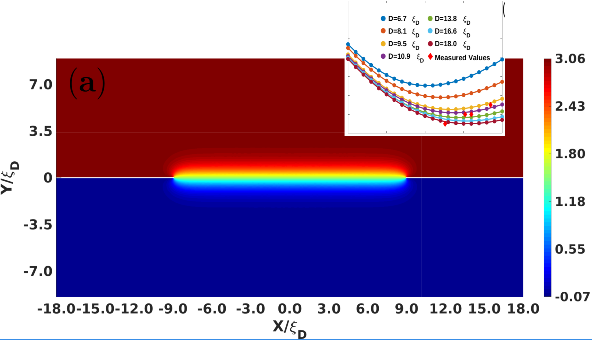
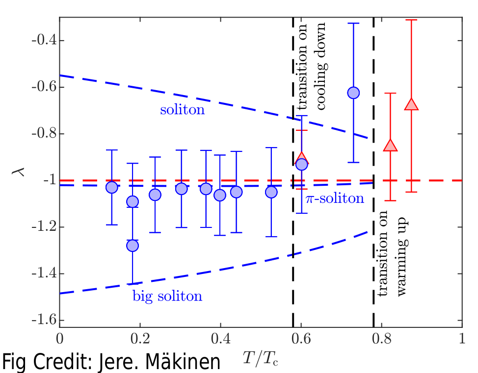

[Home](./)

# Library: Nexus-Soliton (NS)

- last time edited @3rd. Dec. 2022

> The NS project was started five years ago during my PhD time. The outputs have generated two major publications for 2D system. One of them is published on [Nature Communication](https://www.nature.com/articles/s41467-018-08204-8).
>
> When two continuous symmetry breaking phase transitions happen consecutively in superfluid system, there is a chance that new phase is made out by fribration of vacua of the first and the second phase transitions. [(ref1)](https://journals.aps.org/prresearch/abstract/10.1103/PhysRevResearch.2.023263)[(ref2-w/ more mathematics)](https://arxiv.org/abs/2211.17117)
>
> This results in composite defects described by relative homotopy groups. Moreoever, the isomorphic relationship of these relative homotopy make composite objects even more compilcate --- they form nexus.
> 1D nexus has been observed expermentally, with remarkable agreements with NS simulations. [read more in paper](https://journals.aps.org/prresearch/abstract/10.1103/PhysRevResearch.2.043356)

|:-------------------------------------------------------------------------------------------|
|                                                                                            |

Libaray NS was developed with [BFGS nonlinear optimization algorithm](https://en.wikipedia.org/wiki/Broyden–Fletcher–Goldfarb–Shanno_algorithm) and [Galekin method of eigen problem](https://en.wikipedia.org/wiki/Galerkin_method). Finite element Discretization is used for numerical system.

The codes was implemented with Matlab and c++ languages. c++ programs should be complied to be dynamic object files (.so files) with suitbale interfaces before Matlab scripts could call them. However, same functions could be implemented and run without c++ parts, witha a bit slower. Matlab _parfor_ is used for parallelism, and then addtional shell scripts are necessary for running on cluster.

There are still few open implements waiting for more work, for example:
* Random latices for solitions and HQVs --- soliton glass;
* 3-Dimensional finite element mesh for system without translation symmetry along z-direction;
* Adaptive mesh.

If you wanna discuss or have interesting to contribute, plz sent me email: samuel.thecurvature01@gmail.com 

|:-------------------------------------------------------------------------------------------|
|                                                                                            |

Link of repo: [nexus-soliton](https://github.com/Quank-hpc/nexus-soliton)

Open-access data of simulations: [google-drive](https://drive.google.com/file/d/13HOa6kd4vHR0ovrWwttvR5hLMJpFJDXU/view?usp=sharing)